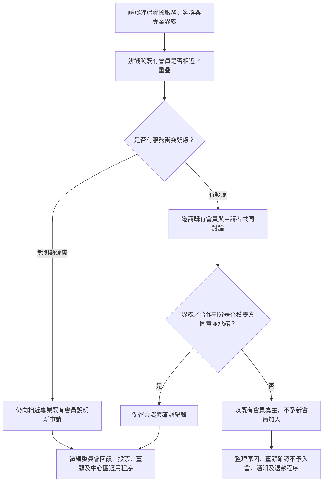
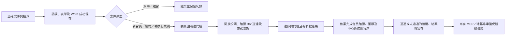

# 富聯副主席工作心智圖

整理日期：2026-09-09。主流程依 現行決策與既有文件；詳細步驟見 [實務交接手冊](vice-chair-handover-playbook.md)，驗收見 [交接清單](vice-chair-handover-checklist.md)。

## 工作總圖

```mermaid
flowchart TB
    VP["副主席：出席紀錄、會員委員會工作與三長協作"]
    VP --> W["每週"]
    VP --> M1["每月第一週"]
    VP --> M2["每月第二週"]
    VP --> C["會員案件"]
    VP --> P["溝通與協調"]
    VP --> H["換屆交接"]
    W --> WA["點名分工 → 實際核對 → 公告群發布 → Connect 登錄"]
    W --> WB["所有關懷／訪談 → 核對進度 → 主責與下一步"]
    W --> WC["會前會、宣誓／畢業、會後追蹤"]
    WC --> WT["歷任主持稿供參考 → 自行準備當次內容與銜接 → 完成適用環節"]
    W --> WR["每週副主席報告：自行撰稿＋每月數據更新＋核心討論重要議題後撰寫宣導"]
    WR --> WP["每週公版 PPT：目標成果、上週出席、地基、商訪、徵求行業 → 交回主席"]
    W --> WD["系統保存地基與各期完成紀錄並提醒；持續追蹤待完成項"]
    M1 --> MA["會員委員會月會"]
    MA --> MB["出席｜成長留員｜續約及輔導｜會員協助｜臨時動議"]
    MB --> MC["記錄決議 → 分工與日期 → 保存／Word → 追蹤"]
    M2 --> MD["月度領導團隊報告"]
    MD --> ME["核心會前會確認 Power of One → 委員會可執行方案"]
    ME --> MF["固定 PPT → 向全體會員報告 → 執行與追蹤"]
    C --> CA["新會員：申請、繳費、專業界線、訪談、正式審核"]
    C --> CB["續約：期限、年度資料、地基必須符合核對、訪談及確認"]
    C --> CC["轉換行業別：專業範圍、訪談及正式審核"]
    C --> CD["期中關懷／離會訪談：表單與 Word → 結案"]
    P --> PA["會員衝突：關心與調解，不裁決"]
    P --> PB["三長：主動交流資訊與想法，正式確認另留證據"]
    P --> PC["代理主席：取得主席稿件與細節 → 核對 → 執行"]
    P --> PD["BOD 講解：當期交流與交易成果 → 互動 → 生態圈／產業鏈 → 邀請合作"]
    H --> HA["帳號、任期、群組、窗口及檔案入口"]
    H --> HB["未結工作與地基 → 接手指派 → 保留歷程"]
    H --> HC["情境演練 → 留存證據 → 補強與複驗"]
    H --> HD["封閉交接：新任自訂目標 → 委員姓名與專業介紹 → 全體開麥宣讀保密承諾"]
```

## 新會員專業別判斷圖

案例：土地買賣與北高雄住宅服務可辨識不同定位，但仍與既有會員說明；住宅服務重疊時共同討論界線，不以同為「房仲」直接通過或直接否決。

## 案件下一步圖

此圖呈現關卡，正式細節按主題流程。平票不形成決議；未通過分支依案件處理通知與退款等後續，不能照通過分支公告。離會登記與離會訪談彼此獨立。

## 日常判斷的四個問題

1. **到時間了嗎？** 看例行週期、案件期限或個別地基起算日。
2. **誰要做下一步？** 一位主責、適用陪訪及跨職務窗口。
3. **真的完成了嗎？** 看已保存、已發出、已回覆或已核准的實際證據。
4. **後面還有承諾嗎？** 訪談或月會結案，不等於後續工作全部結束。
